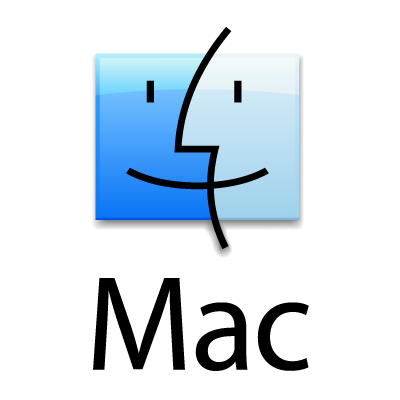
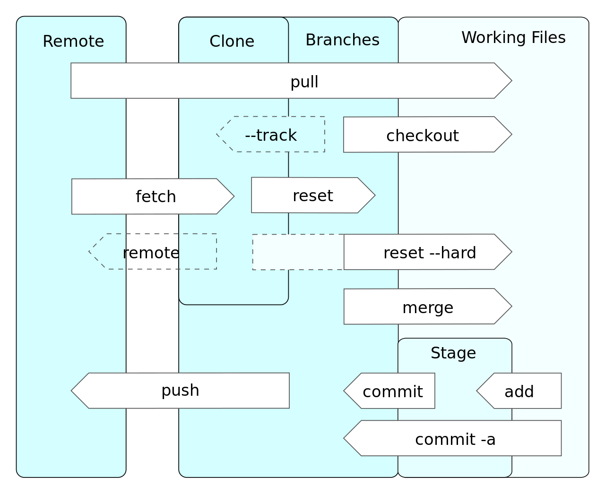

class: middle, center

# Programme

---

## Jours 1

+ Rappels sur l'informatique orienté audio
+ Historique de la programmation
+ Les environnements de developpement
+ Les méthodes de travail

--

## Jours 2

+ Introduction au language lua
+ Découverte de l'API de ReaScript
+ TP : Création de scripts

--

## Jours 3

+ Introduction au language de programmation EEL2
+ Présentation du framework JSFX
+ TP : Créer un plug-in audio

---

# Objectifs

+ Découvrir le monde de la programmation
+ Ajouter la programmation dans sa boîte à outil d'ingénieur du son
+ Comprendre les tenants et les aboutissant de la création d'un plug-in audio

---

# Contact

+ Jean-Loup Pecquais
+ jeanlouppecquais@ik.me

---

class: middle, center

# Préambule

---

## Pourquoi s'intéresser à la programmation ?

--

+ Comprendre le fonctionnement de ses outils

--

+ Pouvoir adapter et/ou construire ses outils

--

+ Mieux investir son temps et son argent

---

class: middle, center

# Généralités

???

+ Qu'est ce qu'un ordinateur ?
+ Qu'est ce qu'un language de programmation ?

---

## Les ordinateurs

+ Ensemble de composants : Processeurs + Mémoires
    + Processeurs : CPU (plusieurs coeurs ou plusieurs CPU), GPU
    + Mémoire de stockage, mémoire vive, etc.

+ Ensemble de logiciels
    + Kernel
    + Gestion des périphériques (audio, vidéo, contrôleurs)
    + Interfaces graphiques (bureau, explorateur de fichiers)

---

## Les systèmes d'exploitations

.pull-left[

**Solutions propriétaires**

```{r, echo=FALSE, fig.show='hold', fig.pos='center', out.width="10%"}
knitr::include_graphics('images/windows.jpg') # nolint # nolint
 # nolint # nolint
```
```{r, echo=FALSE, fig.show='hold', out.width="10%"}
```

+ Windows (Microsoft)
+ MacOS (Apple)

    
]

.pull-right[

**Solutions libres**

```{r, echo=FALSE, fig.align="center", out.width="10%"}
knitr::include_graphics('images/linux.png') # nolint # nolint
```

+ Linux/GNU (Libre et gratuit)


]

--


**Choisir son OS ?**


--

+ MacOS : Linux clef en main

--

+ Linux : MacOS en kit

--

+ Windows : ?

---

## Informatique embarquée / informatique généraliste

.pull-left[

Informatique embarquée
+ Optimisé pour une tâche (exemple : console de mixage numérique)

]

.pull-right[

Informatique de "bureau"
+ Polyvalente mais non spécifique

]

On peut également évoquer l'informatique destinée aux serveurs.

---

## Les défis de l'audio-numérique sur ordinateur générique

+ Le traitement de l'audio en temps réel !
--

    + Equipement non dédié (donc non optimisé)
--
    + Tous les kernels ne sont pas égaux.
--
    + Toutes les bus de communication ne se vallent pas (USB vs PCIe par ex.)
--
    + Tous les pilotes d'interfaces audio non plus.
--
    + Ainsi que les logiciels ( Pro Tools & REAPER par ex. ;-) ) 

???

Kernels : "noyau" // Générique VS low-latency VS real-time // différences de scheduler et de gestion des priorités. // FIFO - LILO - FILO etc.

---

## Les défis du développement orienté audio

Au delà de la qualité sonore d'un plug-in

+ Optimiser la charge CPU
+ Prendre le minimum de temps possible

Dans les deux cas, la question est souvent : à quel prix sur le rendu audio ?

---

### Exemple concret : égaliseur

.pull-left[

**ReaEQ (Cockos)**

```{r, echo=FALSE, fig.align="center", out.width="85%"}
knitr::include_graphics('images/reaeq.jpg') # nolint # nolint
```

+ **temps réel**
+ Cramping vers la fréquence de Nyquist.


]

.pull-right[

**Pro-Q3 (Fab Filter)** :

```{r, echo=FALSE, fig.align="center", out.width="85%"}
knitr::include_graphics('images/proq3.jpg') # nolint # nolint
```

+ *zéro latence* : **temps réel**, sans cramping. Déphasage du filtre se réplie à Nyquist.
+ *natural phase* : **320 smpl** de latence, plus de cramping
+ *phase linéaire* : de **3072 smpl** à **66560 smpl**, inutilisable pour du temps réel.


]


---

### Exemple concret : compresseur

.pull-left[

**ReaComp (Cockos)**

```{r, echo=FALSE, fig.align="center", out.width="80%"}
knitr::include_graphics('images/reacomp.png') # nolint # nolint
```

+ **Temps réel**
+ **Repliement spectral** (aliasing) lorsque les temps d'attaque et de relâchement sont court.

]

.pull-right[

**Molotok (Tokyo Dawn Lab)**

```{r, echo=FALSE, fig.align="center", out.width="85%"}
knitr::include_graphics('images/molotok.jpg') # nolint # nolint
```

+ Plusieurs modes permettant d'ajuster le ratio latence/performance audio.
+ **"Alias"** en mode **temps réel**.
+ Les modes éco et précise utilise certainement du sur-échantillonnage pour réduire le repliement spectral.

]

---

### Exemple concret : saturation

.pull-left[

**Saturation (Cockos)**

```{r, echo=FALSE, fig.align="center", out.width="85%"}
knitr::include_graphics('images/saturation.png') # nolint # nolint
```

+ temps réel
+ Forte présence d'alisaing
+ Léger en ressource.

]

.pull-right[

**ChowTapeModel (LOSER)**

```{r, echo=FALSE, fig.align="center", out.width="70%"}
knitr::include_graphics('images/chowtapemodel.png') # nolint # nolint
```

+ Latence de 36 smpl par défaut.
+ Jusqu'à 102 smpl de latence à OS*16 en phase linéaire.
+ Très gourmand en ressource, mais rendu "qualitatif".

]


---

## Les qualités d'un plug-in

+ Chercher le meilleur rapport entre performance et qualité de rendu sonore
+ Stabilité sur les différents formats (VST, VST3, AAX, AU, LV2, etc.)
+ **Et l'interface utilisateur !**

---

class: middle, center

# La programmation et ses langages

---

## Que signifie "programmer"

+ Donner des instructions au processeur.
+ Pour cela on utilise un langage.
+ L'utilisation d'un langage plutôt qu'un autre viendra définir un équilibre entre performance, fonctionnalités, et facilité de développement.

---

## Les différents types de languages

Du niveau le plus bas au plus haut (du plus proche de la machine au plus proche de l'utilisateur)

--

+ Le language assembleur

--

+ Les languages compilés

--

+ Les languages interprétés

---

## Hello world en assembleur !

En assembleur :

~~~
str:
 .ascii "Hello World!\n"
 .global _start

_start:
movl $4, %eax
movl $1, %ebx
movl $str, %ecx
movl $8, %edx
int $0x80
movl $1, %eax
movl $0, %ebx
int $0x80

;Compilation:
;as code.s -o code.o
;ld code.o -o code

;Execution:
;./code
~~~

---


## Hello world en C++ !

En C++ :

~~~
#include <iostream>
using namespace std;
int main() {
   cout << "Hello World!" << endl; // This prints Hello, World!
   return 0;
}
~~~

---

## Hello world en lua !

~~~
print("Hello World!")
~~~

---

### Les langages compilés vs langages interprétés

.pull-left[

```{r, echo=FALSE, fig.align="center", out.width="40%"}
knitr::include_graphics('images/compiler.png') # nolint # nolint
```

]

.pull-right[

```{r, echo=FALSE, fig.align="center", out.width="40%"}
knitr::include_graphics('images/interpreter.png') # nolint # nolint
```

]

???

Démonstration de la compilation et de l'utilisation d'un logiciel

---

# Langages à "connaître"

--

Le **C** (1972), développé par par Dennis Ritchie et Kenneth Thompson, aux laboratoires Bell.

--

+ C++ (1983, représente la majorité des applications informatiques)
+ Lua (REAPER, TouchOSC)
+ JavaScript (MaxMSP, Open Stage Control, Chataîgne)
+ Faust (Développement DSP facilité)
+ Python (Boîte a outil extrêmement complète, alternative à Mathlab)

--

En sus :
+ Markdown (prise de note, création de document)
+ Rmarkdown (alternative à LaTeK)

???

Connaître dans le sens : connaître son existance. Il ne s'agit pas d'apprendre tout ces langages.

---

class: middle, center

# Les environnements de développement

---

## Qu'est ce qu'un IDE ?

--

* Environnement de développement intégré

--

* Regroupe un ensemble de fonctionnalités :

--

    * Un éditeur de texte
    * Une aide à l'écriture (auto-complétion)
    * Un terminal
    * Un compileur / un interpréteur
    * Un gestionnaire de projet

--

**Quelques exemples**

--

.pull-left[

* Les classiques
    * Visual Studio
    * X-Code
    * CodeBlock
    
]

--

.pull-right[

* Les plus "modernes"
    * Visual Studio Code
    * Sublime text
    * PyCharm/Clion/JetBrain

]

---

class: middle, center

## Les frameworks

---

### Le principe

--

* Proposer un socle de fonctionnalités de base :
    * Accesseur audio, une librairie graphique, blocs DSP élémentaires, etc.

--

### Quelques exemples

--

.pull-left[

**JUCE**

* Utilisé par la grande majorité des plug-ins du marché
* Appartient à PACE
* Soutenu par une grande communauté

]

--

.pull-right[

**FLUX:: Framework**

* Très complet et très puissant
* Réservé à la société FLUX::
* Très peu d'utilisation en dehors des produits FLUX::

]

--

**Waves**, **UAD**, **MeldaProduction**, sont des exemples de marques utilisant leur **propre** framework.

---

class: middle, center

## Les SDK

---

### Présentation

* SDK signifie : Software Development Kit
* Outil délivré à des développeurs par des développeurs pour des développeurs
* Exemple : SDK VST3 de Steinberg

<!-- * SDK signifie : Software Development Kit -->

---

class: middle, center

## Les API

---

### Présentation

* API signifie : Application Programming Interface
* Ensemble de classes, méthodes, fonctions et variable
* Permet à deux logiciels de s'interfacer

---

### Exemples

**L'API de REAPER**

---

class: middle, center

# Les logiciels de gestion de version (et de projet)

---

## Travail colaboratif

* Le développement est un travail d'équipe
    * Architècte logiciel
    * Implémentation bas niveau, framework
    * Implémentation DSP
    * Implémentation graphique
    * etc.
* Plusieurs personnes peuvent être amenées à manipuler les mêmes fichiers
* Certaines modifications peuvent casser le programme, comment revenir en arrière ?

---

## Git

* Créé par Linus Torvald
* Open-source 
* Logiciel de gestion de version le plus utilisé au monde.

---

### Solutions utilisant Git

* GitHub
* GitLab
* BitBucket
* NPM

---

### Comment fonctionne GitHub

```{r, echo=FALSE, fig.align="center", out.width="70%"}

```

---

class: middle, center

# TP : Configuration d'un environnement de travail

---

## A faire

+ Installer Visual Studio Code
+ Installer Git
+ Créer un compte sur GitHub
+ Cloner le repository suivant :

<code>github.com/mon/repository/ENSLL</code>

---

class: middle, center

# Introduction au langage lua

---


# Jours 1

## Historique de la programmation

Languages compilés VS Languages scriptés

Performance VS praticité

**copié collé**

[https://fr.wikibooks.org/wiki/Programmation/Historique](https://fr.wikibooks.org/wiki/Programmation/Historique)

[https://en.wikipedia.org/wiki/Assembly_language](https://en.wikipedia.org/wiki/Assembly_language)

[https://en.wikipedia.org/wiki/Fortran](https://en.wikipedia.org/wiki/Fortran#Obsolescence_and_deletions)

[https://simple.wikipedia.org/wiki/C_(programming_language)](https://simple.wikipedia.org/wiki/C_(programming_language))

[https://simple.wikipedia.org/wiki/Compiler](https://simple.wikipedia.org/wiki/Compiler)

[https://en.wikipedia.org/wiki/C%2B%2B](https://en.wikipedia.org/wiki/C%2B%2B)

L'arrivée de la logique programmable provoqua une cascade 
d'inventions : l'assembleur (c'est à dire l'utilisation de mnémoniques à
 la place des séquences de chiffres du langage machine) fut inventé en 
1948, le premier langage évoluée, l'A0, en 1951, suivi du [Fortran](https://fr.wikibooks.org/wiki/Programmation_Fortran) (1956), du [Cobol](https://fr.wikibooks.org/wiki/Programmation_Cobol) (1959), du [Lisp](https://fr.wikibooks.org/wiki/Programmation_Lisp) (1959) et de l'[Algol](https://fr.wikibooks.org/wiki/Programmation_Algol) (1960).

Le [Basic](https://fr.wikibooks.org/wiki/Programmation_Basic) est créé en 1965 et le [Pascal](https://fr.wikibooks.org/wiki/Programmation_Pascal) en 1968. Le [C](https://fr.wikibooks.org/wiki/Programmation_C) et [Prolog](https://fr.wikibooks.org/w/index.php?title=Programmation_Prolog&action=edit&redlink=1) voient le jour en 1972 et [Smalltalk](https://fr.wikibooks.org/wiki/Programmation_Smalltalk), le premier langage objet, la même année.

La programmation orientée objet prendra son essor avec [C++](https://fr.wikibooks.org/wiki/Programmation_C%2B%2B), créé en 1983. En 1986 est créé [Perl](https://fr.wikibooks.org/wiki/Programmation_Perl). [Python](https://fr.wikibooks.org/wiki/Programmation_Python) est créé en 1991 et 1995 verra l'apparition de [Java](https://fr.wikibooks.org/wiki/Programmation_Java), qui prétend être portable au niveau de l’exécutable, et de [PHP](https://fr.wikibooks.org/wiki/Programmation_PHP). 2000 voit l'apparition du premier langage créé par Microsoft, [C#](https://fr.wikibooks.org/wiki/Programmation_C_sharp).

Les [langages de description](https://fr.wikipedia.org/wiki/Langage_de_d%C3%A9finition_de_donn%C3%A9es), pas assez complets pour être considérés comme des langages de programmation, apparaissent vers 1969, avec le [GML](https://fr.wikipedia.org/wiki/Standard_Generalized_Markup_Language) puis le [SGML](https://fr.wikipedia.org/wiki/Standard_Generalized_Markup_Language).
Le [HTML](https://fr.wikibooks.org/wiki/Programmation_HTML) est créé en 1990.
En 1996 est introduit [XML](https://fr.wikibooks.org/wiki/Programmation_XML).
Ces deux derniers langages sont dérivés du SGML : leur syntaxe reprend différentes parties de celle du SGML.

Les travaux actuels semblent montrer que la tendance vers plus 
d'abstraction se poursuit, avec la programmation orientée aspect, par 
exemple.

## Les environnements de développement

IDE (VS Code?)

Framework

JUCE (juste présenter, représente 80% des PI)

FLUX:: (en contre exemple à JUCE)

SDK

API Ode à la documentation

GIT (Avec GUI)

Repo

Branche

Pull

Commit

Push

Pull Request

## Configurer le dépôt gitHub de la promo

Un repo sur mon compte, une branche par élève.

# Jours 2

## Introduction au lua

[https://www.lua.org/manual/5.4/](https://www.lua.org/manual/5.4/)

Présentation générale

- Variable
- Fonction
- Tableau
- Conditionnelles
- Boucle for

De l’importance de bien commenter

## Présentation de l’API de REAPER

- Bienvenu en Corrèze

## Scriptons !

- Gestion de la tête de lecture
- Utilitaire de création de DDP
- Créer un groupe de piste
- Faire un fader unity
- Découper un objet avec le curseur de la souris, sans déplacer la tête de lecture
- Créer une piste auxiliaire pour les pistes sélectionnées
- Créer une piste auxiliaire par pistes séléctionnées

# Jours 3

## Présentation eel2

[https://www.cockos.com/EEL2/](https://www.cockos.com/EEL2/)

Le C en sms

## Codons !

- Matrice MS
- Panoramique d’intensité
- Panoramique de temps
- Panoramique de temps et d’intensité
- Elargisseur mono/stereo (compatible mono)
- Chorus
- Flanger
- Phaser
- Rotation de phase linéaire, sans FFT
- Délai
- Compresseur (? à évaluer)